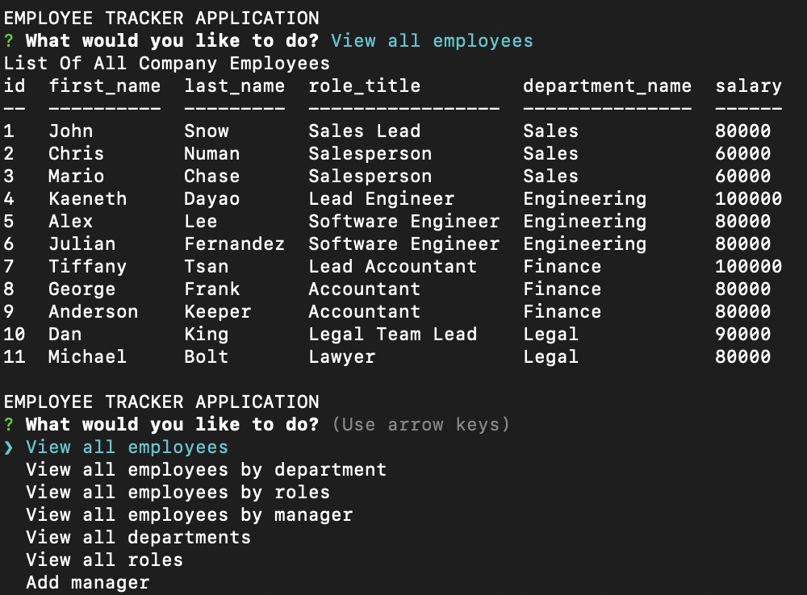

# Employee-Tracker

## Description

Employee Tracker is a command line employee management application. This application allows users to view and add company departments, roles, and employees to their employee database.

## Table of Contents

* [Description](#description)
* [Technology](#Technology)
* [User Story](#user-story)
* [Installation](#installation)
* [Usage](#usage)
* [License](#license)
* [Contributing](#contributing)
* [Tests](#tests)
* [Questions](#questions)
* [Deployed Application URL](#deployed-application-URL)

## Technology

- Javascript
- Inquirer
- MySQL

## User Story

As a business owner
I want to be able to view and manage the departments, roles, and employees in my company
So that I can organize and plan my business

## Installation

You will need to npm install mysql and inquirer. You will also need to connect to the MySQL server and run the query in the seed.sql file.

## Usage

After installation, to run the application type in node tracker.js in your command line. You will be prompted to choose what you would like to do. You can view employees, departments, roles, and managers. You also have the ability to add new employees, managers, departments, and roles.

## License

## Contributing

Please follow standard contributing guidelines.

## Tests

No tests to run.

## Questions

For any questions, please contact kendayao at kendayao@gmail.com

## Deployed Application URL

Video Demo of Application: https://youtu.be/u9cqWbXgdTg

